# Repositório Raspiberry Pi Pico

Esse repositório consiste e armazenar códigos e procedimmmentos parmutilizarm o
Raspberry Pi Pico. Separei e adaptei o código para um macro keyboard 2x3 e um
split keyboard que contruí.

Lembrado que para esses códigos funcionarem no Pico, será necessário innstalar
o firmeware do AidaFruit HID e utilizar o editor de sua preferência.(No meu caso
eu usei o editor Thony pois ele fornece algumas facilidades.)

# Meu teclado e passo a passo

Contruí esse teclado em um Raspberry Pi Pico com base no código
(Keyboard_KMK/code.py)

Mapeameto de teclas:
http://kmkfw.io/docs/keycodes

### Iniciando o projeto

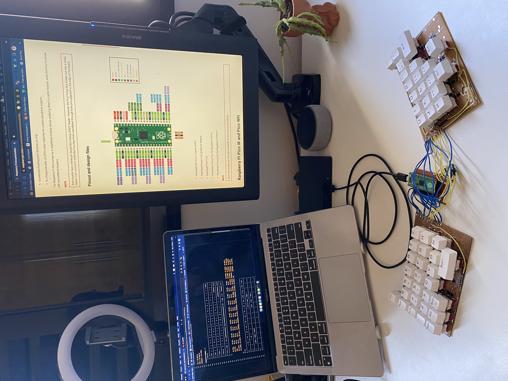.

Segue a lista de componentes que eu utilizei:

- 2 placas de fenolite de 15x20.
- 47 plugs hotswap.
- 47 switches com keycaps.
- 30 diodos zenner.
- 1 metrto de fio.
- Raspberry Pi Pico.
- Soquete para 40 pinos (Para o Pico).
- Cabo USB.
- Ferro de solda.
- Estanho.

## Fotos

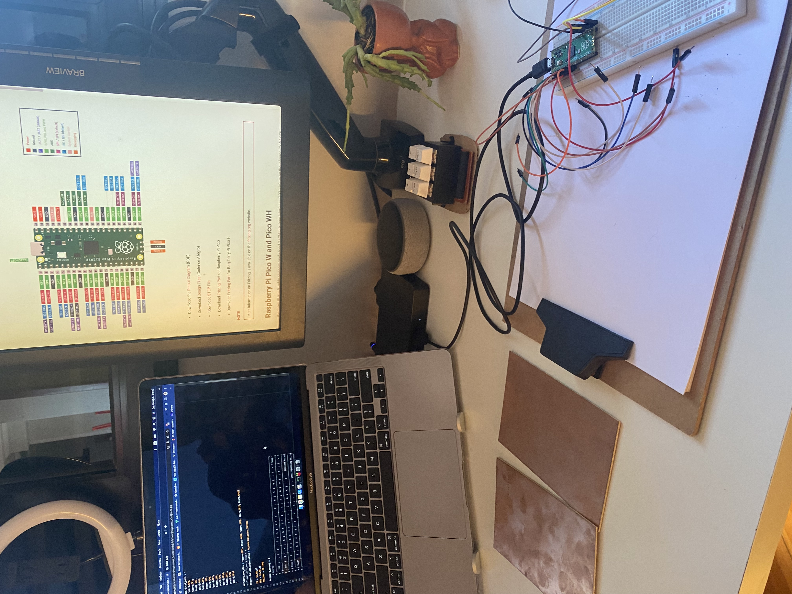.
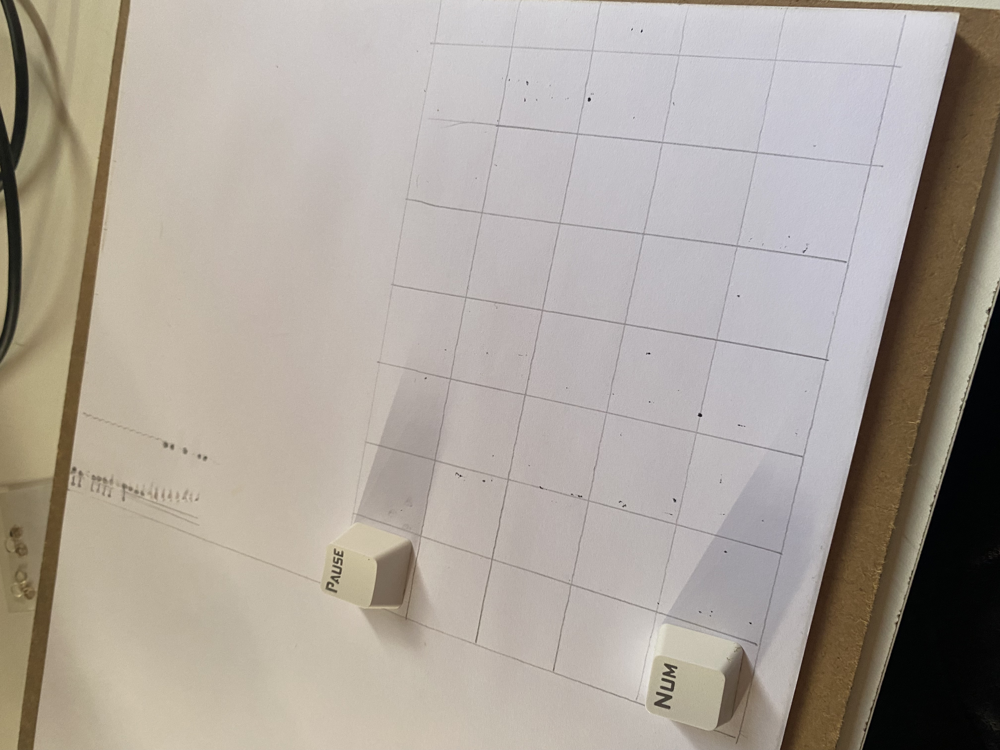.
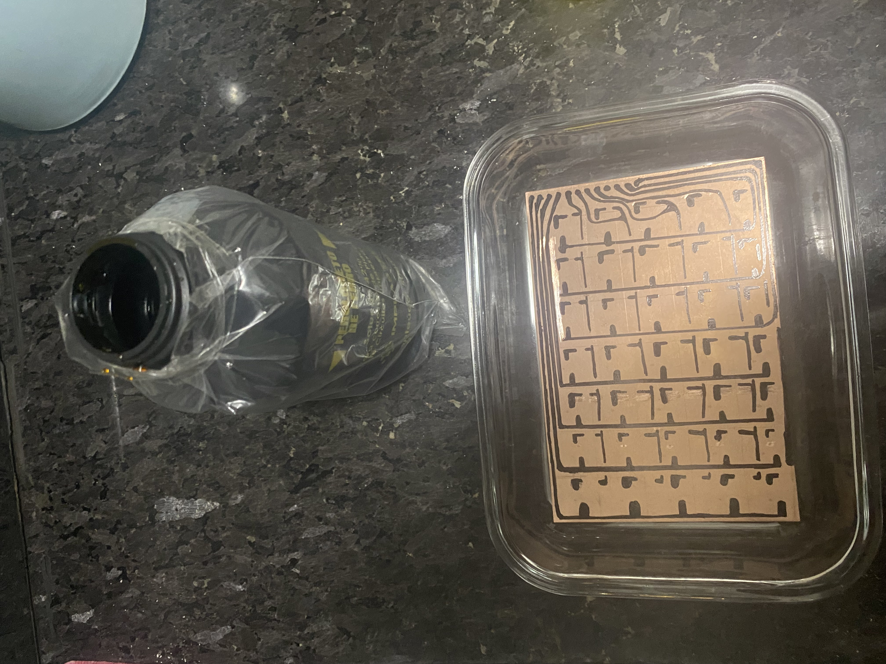.
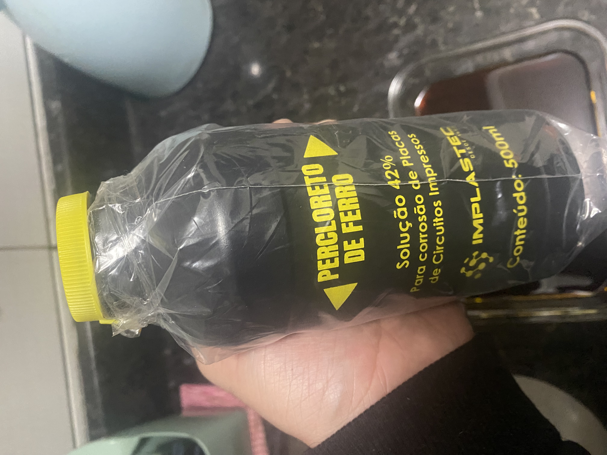.
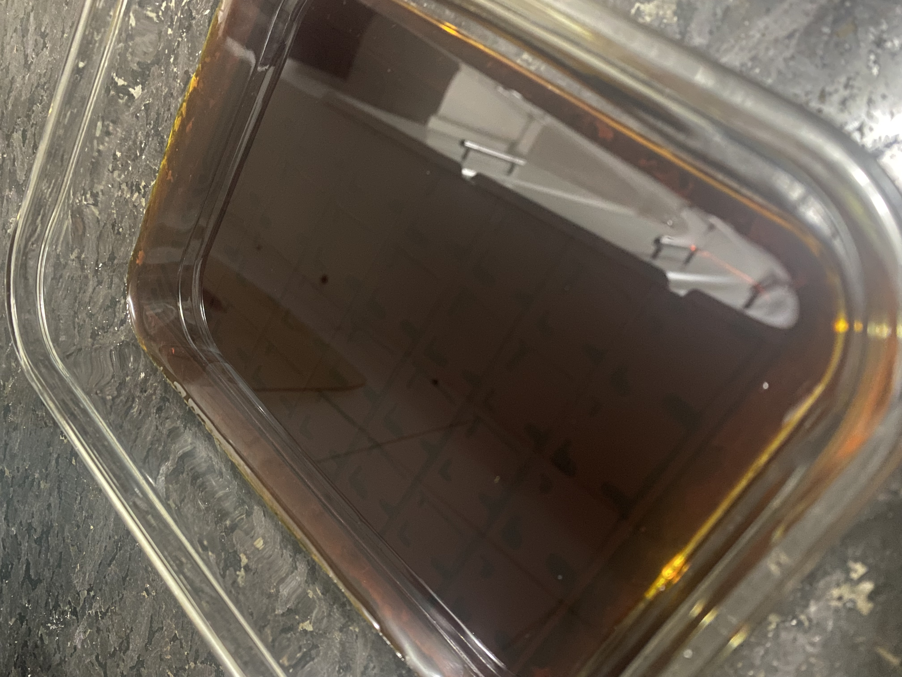.
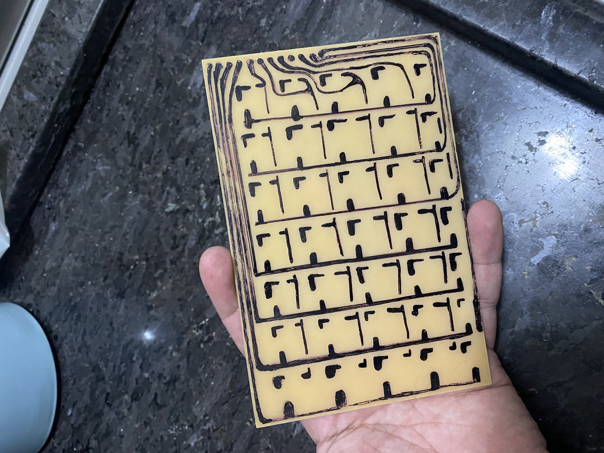.
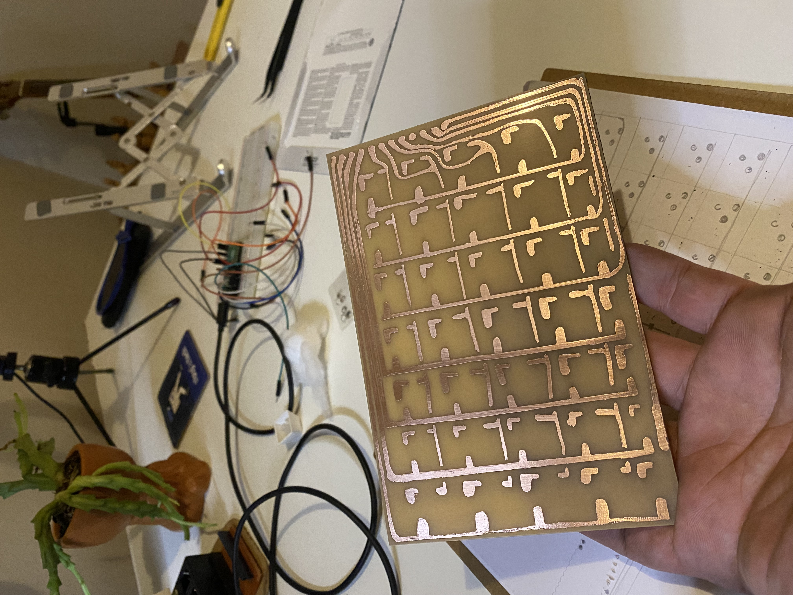.
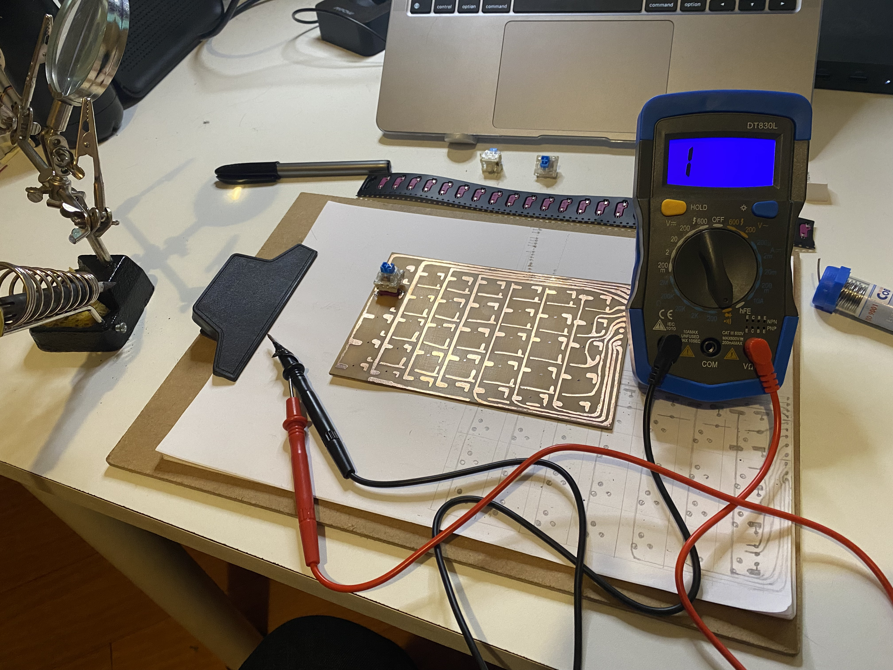.
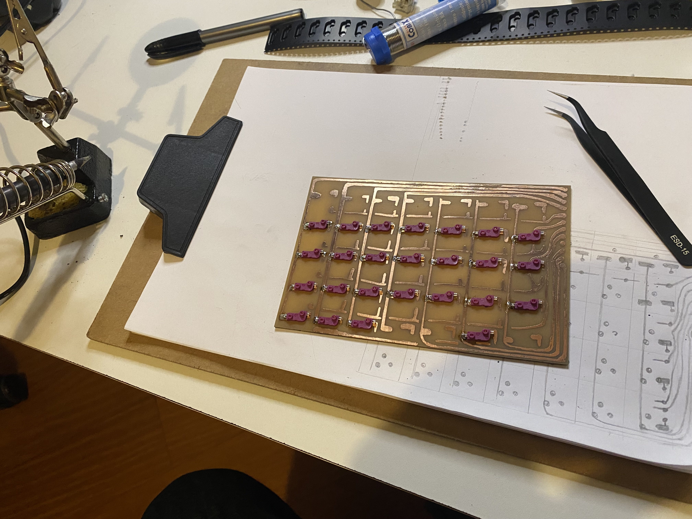.
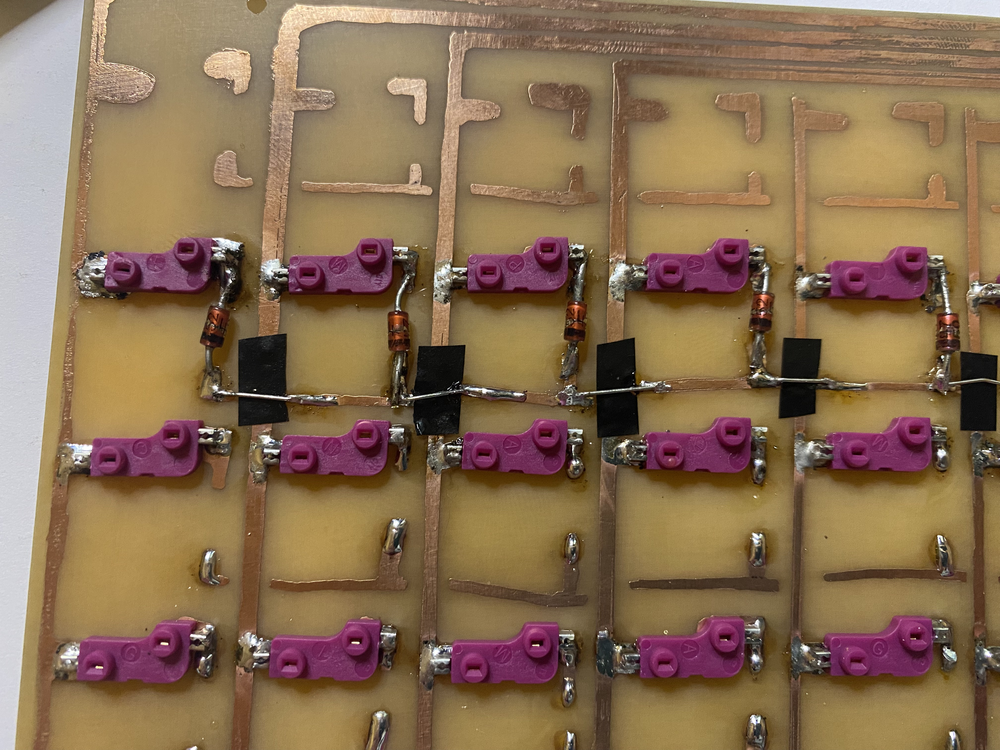.
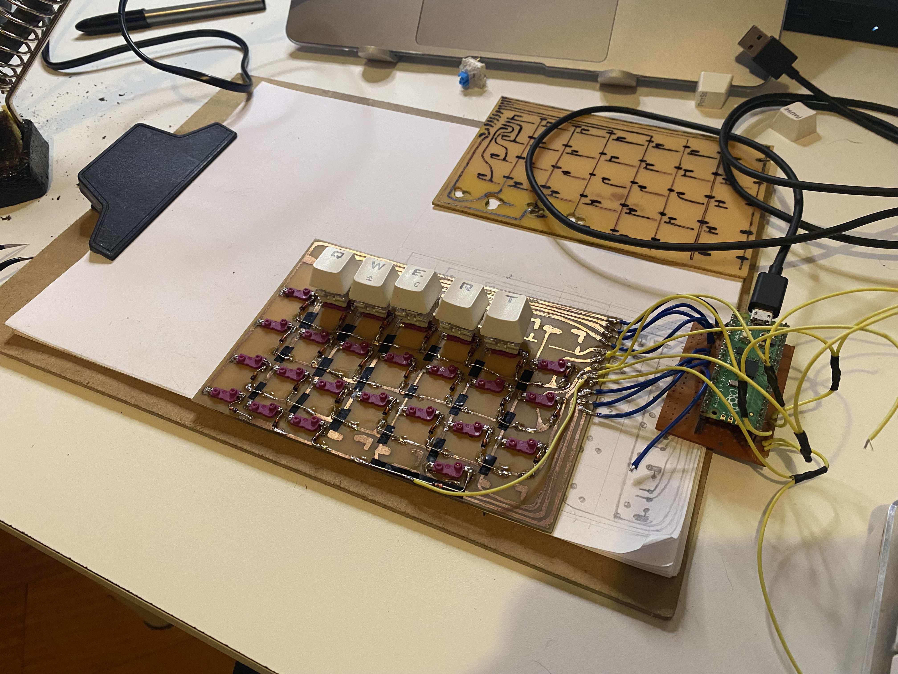.
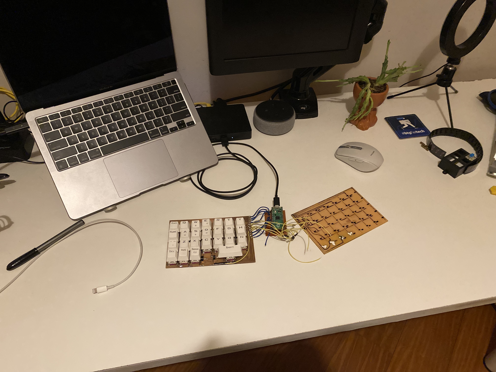.
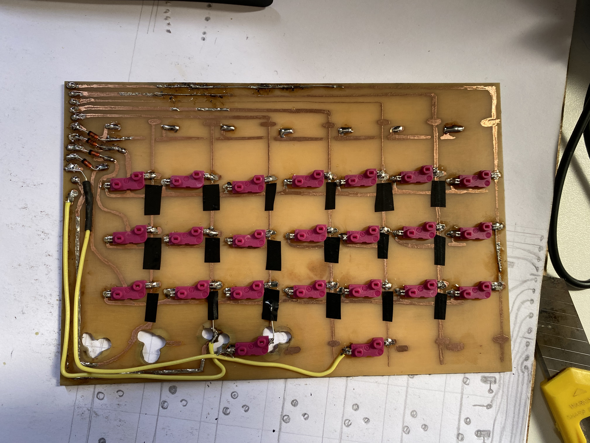.
